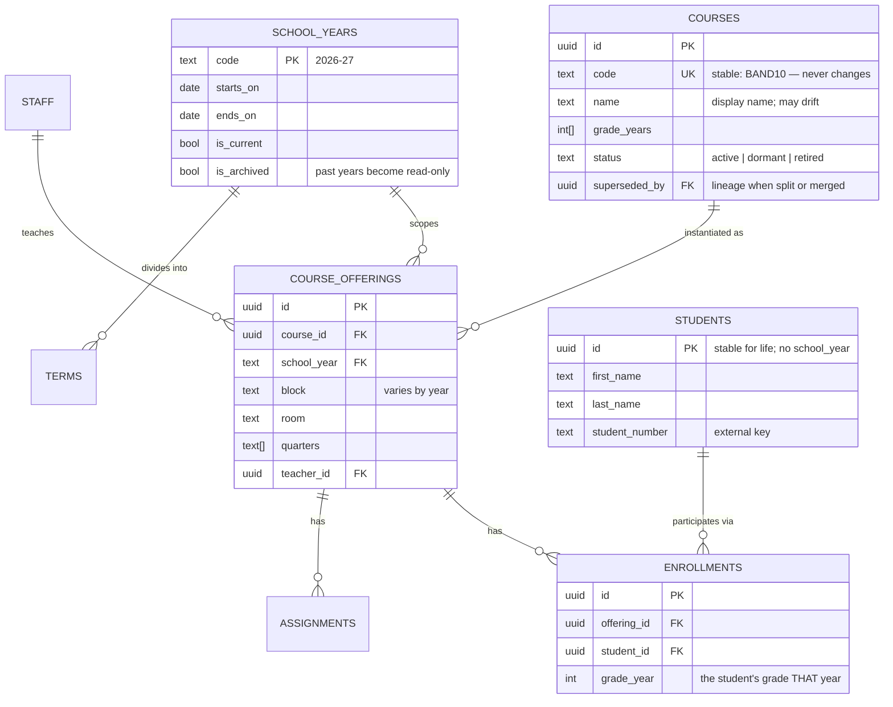

# Course Hub — Multi-Year Data Architecture

Goal: one system that accumulates a teaching career's worth of records — many
school years, new timetables and new students each year — without rewriting
history or duplicating people.

This document describes the **target** model and the gap between it and today.
Nothing here has been applied beyond `rcs.course_blocks`.

---

## 1. What breaks today

Each of these is observed in the live database, not hypothetical.

| # | Problem | Evidence | Consequence in year 2+ |
|---|---|---|---|
| 1 | Year-specific facts stored on the course row | `rcs.courses.school_years` is an array with a single `block` column | A course in two years cannot hold two blocks. Patched with `course_blocks`; the same patch will be needed for room, teacher, section… |
| 2 | Quarters have no school year | `public.school_quarters` = 4 rows, ids 1–4, dates hard-coded to 2025-26 | Next year overwrites this year's dates. Quarter history is lost permanently |
| 3 | ~~Student identity is year-scoped~~ **Resolved** | `enrollments.grade_year` added; 2026-27 imported by matching returning students to their existing row | 76 students now hold enrollments in both years under one identity. `students.school_year` is vestigial and can be dropped |
| 4 | ~~Two competing course tables~~ **Resolved** | Course Hub (`public.courses`) is now the source of truth for all course data; `rcs.course_hub_links` maps it to enrollments | — |
| 5 | Two competing student tables | `public.students` (145) and `rcs.students` (5) | Querying the wrong one silently returns almost nothing. `rcs.students` is test data — numbers 10001–10004 plus 999999, created Mar 2026; 3 of 5 duplicate a real `public.students` person under a different UUID |
| 6 | Missing referential integrity | No FK on `rcs.enrollments.student_id` | The 1 orphaned enrollment was a test-data row (removed); nothing prevents more without the FK |
| 7 | Flat authorisation | Every `rcs.*` policy is `ALL` to `authenticated` using `true` | Any signed-in account reads every student in every year. No per-teacher scoping, no read-only past |
| 8 | Free-text years | `'2025-26'` as a string in courses, enrollments, students, course_blocks | A typo creates a silent phantom year. No canonical list to drive the UI |
| 9 | No stable course identifier | `slug` NULL on all 25 `rcs.courses`; `superseded_by` NULL on all 33 `public.courses` | A course is identifiable only by name — and names drift ("Computer Studies 10" → "Computer Studies 10 Q1/Q2" → "CS10 (Q1/Q2)"). After a gap year, nothing reconnects the course to its own history |
| 10 | "Not taught this year" is unrepresentable | 4 courses carry an empty `school_years` array | A course you are simply not teaching this year is indistinguishable from junk data |

---

## 2. Target model

> **Source of truth: Course Hub.** All course data is read from and stored in
> `public.courses`. It already holds one row per course per school year with
> that year's block, room, quarters and sort order — i.e. it is already the
> `COURSE_OFFERINGS` table below, and `rcs.course_blocks` is superseded by it.
> What it still lacks is a catalogue table giving a course a stable identity
> *across* years; see §3.

The organising idea: **separate the timeless thing from its yearly instance.**

A *course* ("Band 10") is timeless. A *course offering* ("Band 10, 2026-27,
block D, room 130") is the yearly instance. Everything year-specific — block,
room, quarters, enrollments, assignments — hangs off the offering.

Likewise a *student* is a person who persists; an *enrollment* is that person's
yearly participation.



### Why each change earns its place

**`school_years` as a table, not a string.** Gives a canonical list to drive the
year selector, a home for term dates, and — critically — an `is_archived` flag
that RLS can enforce. Every year reference becomes a foreign key, so a typo
fails loudly instead of creating a phantom year.

**`course_offerings` replaces `school_years[]` and `course_blocks`.** Any
attribute that varies by year now has an obvious home. This is the change that
stops the recurring "add another side table" cycle — `course_blocks` was
already the first instance of it.

**`students` loses `school_year`; `enrollments` gains `grade_year`.** A student
is one row forever. Their grade level is a property of a given year's
enrollment, not of the person. This is what makes "show me this student across
four years" possible — and it is much harder to retrofit later, once duplicate
rows exist.

> **Done.** `enrollments.grade_year` exists and is populated for both years. The
> 2026-27 import (266 enrollments, 218 students) matched 76 returning students
> to their existing rows rather than creating duplicates. Every one of those 76
> advanced exactly one grade — 9→10 (31), 10→11 (23), 11→12 (22) — which is also
> the check that confirms the name matching did not cross two people.
> `students.school_year` is now vestigial.

**Assignments attach to `offering_id`.** Today they attach to `course_id`, so an
assignment cannot be attributed to a year when the course spans two.

---

## 3. Course continuity across gap years

A course may run, pause for one or more years, then return. This is a normal
part of a teaching assignment, not an exception, and the model must treat it
as such.

**A gap is the absence of an offering, nothing more.** The course row lives in
the catalogue permanently and is never deleted or emptied:

```
courses:            BAND10  "Band 10"        status = active
course_offerings:   BAND10 × 2025-26  block B
                    (no row for 2026-27  ← the gap)
                    BAND10 × 2027-28  block C
```

Because history hangs off offerings rather than the course, the 2025-26
enrollments, assignments and marks stay intact and attributable throughout the
gap. Resuming in 2027-28 is a single insert.

Three properties make this safe:

**1. A stable `code`, never the name.** `BAND10` is the identity; the display
name may change freely. This is what reconnects a returning course to its own
history — and the live data shows why it matters, with one course already
carrying three different names across two years. Matching on name would silently
create a *new* course and orphan everything before the gap.

**2. `status` distinguishes dormant from retired.** Not teaching a course this
year is `dormant` — it stays in the catalogue, out of the year's UI, ready to
resume. `retired` means genuinely gone. Today both look identical (an empty
`school_years` array), which is why four real courses currently sit in limbo.

**3. Clone forward from the most recent offering, not last year's.** When
resuming, prior materials should come from whenever the course last ran:

```sql
-- the offering to copy assignments from when reviving a course
select * from course_offerings
where course_id = $1 and school_year < $2
order by school_year desc
limit 1;
```

A "copy from previous year" implementation would silently find nothing after a
gap and hand back an empty course.

`superseded_by` covers the related but distinct case where a course does not
pause but *changes shape* — "Worship Leadership 11/12" becoming "WL 11" and
"WL 12". The lineage pointer keeps the old offerings reachable without
pretending the new courses are the same one.

### What this makes easy

- *"Every year I have taught this course"* — offerings by `course_id`.
- *"What did I do last time I taught this?"* — most recent prior offering.
- *"Which courses could I revive?"* — `status = 'dormant'`.
- Year selector lists only years with offerings, so a gap year never shows an
  empty course that was not actually running.

---

## 4. Data coverage: absence of records vs absence of students

An empty roster has two very different meanings:

- **No students enrolled** — a real, factual zero.
- **No records kept** — the system was not in use for that period, so the
  absence says nothing about what happened.

Today these are indistinguishable, and the archive silently asserts the first
when the second is true. The live example: the app was implemented partway
through 2025-26, from Q3. `ICT 9 Q1` and `ICT 9 Q2` ran in Q1 and Q2 with real
students, but no roster was ever captured; both now show zero. `Concert Band 9`
(Q3/Q4) has its genuine roster of 36 because it falls after adoption.

The zero on those two ICT sections is therefore **correct as a record** and
**wrong as a fact** — precisely the distinction this section exists to preserve.

A worse variant was already present and has been removed: a bulk import had
assigned all 36 grade-9 students to every block H course, so both ICT sections
falsely reported full rosters. The importer split by grade year, which works
wherever grades differ — blocks A, B and F show zero overlap between their
courses — but block H's three courses are all grade 9, so it could not
distinguish them and assigned everyone to all three. Fabricated records are
more damaging than absent ones: they survive scrutiny.

Over a career this compounds: each gap — a term before adoption, a leave, a
migration — becomes indistinguishable from a genuine zero, and the ability to
tell them apart lives only in memory.

**Record the coverage window as data.** The `school_years` table gains the
period from which records are known complete:

```sql
alter table school_years
  add column records_from date,          -- null = no records kept this year
  add column records_note text;          -- "adopted mid-year, from Q3"
```

For 2025-26 that is the start of Q3, **2026-01-19** — confirmed: the app was
implemented at Q3. Any course whose teaching period falls entirely before
`records_from` is *outside coverage*, and the UI must say so rather than
showing a zero:

> **No records for this course.** CourseBoard was not in use during Q1–Q2 of
> 2025-26. This course ran in Q1; its roster predates the system.

Because Course Hub already stores `quarters` per course and `school_quarters`
holds the dates, this is derivable — no per-course flagging needed.

### Why this belongs in the schema

The distinction cannot be reconstructed later. A future reader — including you
in 2032 — sees only an empty list, and nothing in the data indicates whether to
trust it. Recording coverage once, at the point the gap is known, is the only
moment the information is cheaply available.

It also protects any statistic computed across years. Enrolment totals, "students
taught", and per-course histories are all wrong if uncovered periods are counted
as zeros rather than excluded.

---

## 5. Keeping Course Hub the single source

Several apps share this database. Course data currently exists in **three**
places, and they disagree:

| Table | Rows | Created | Read by |
|---|---|---|---|
| `public.classes` | 35 | Feb–Jun 2026 | Day plans, TOC, group maker, kawahoot, `public.enrollments` |
| `public.courses` | 32 | 27 Jun 2026 | CourseBoard, group maker (`source_course_id`) |
| `rcs.courses` | 25 | — | Report card tool; CourseBoard via `course_hub_links` |

`public.courses` is the newest and richest, and Course Hub is **already
mid-migration** from `classes` to `courses`: of 464 rows in
`public.enrollments`, 283 carry a `course_id` and 181 do not.

### The drift is live, not theoretical

`public.classes` still contains the `Computer Studies 10 Q1/Q2` row for
2025-26 that was deleted from `public.courses` — a course that never ran.
The two tables disagreed within minutes of the correction.

They also disagree structurally. `classes` collapses what `courses` splits:

| `public.classes` | `public.courses` |
|---|---|
| `Band 10-12` (one row) | `Band 10`, `Band 11`, `Band 12` |
| `Computer Programming 11/12` | `CP 11`, `CP 12` |
| `Worship Leadership 11/12` | `WL 11`, `WL 12` |
| `Career Class 10`, block `CL` | `Career Life Education 10`, block `CLE` |

This is why four `rcs.courses` rows looked like orphans: they were seeded from
`classes` naming, not `courses` naming.

### 181 enrollments are currently unattributable

Every unmigrated enrollment points at a `classes` row with a **null
school_year**, so it belongs to no year at all:

| Class | Students stranded |
|---|---|
| Concert Band 9 | 36 |
| Senior Concert Band | 28 |
| Computer Studies 10 | 26 |
| Worship Leadership 11/12 | 22 |
| Career Life Education 10 | 20 |
| Biblical Perspectives 10 (C) | 18 |
| Computer Programming 11/12 | 16 |
| Biblical Perspectives 10 (D) | 15 |

These are real rosters. They are invisible to any app that filters by year.

Note the collapsed rows can still be split mechanically: `public.students`
carries `grade_year`, so a `Senior Concert Band` enrollment resolves to
`Band 10`/`11`/`12` by the student's own grade.

### Consumer audit

Every repo sharing this database, by table actually queried:

| App | `courses` | `classes` | Notes |
|---|---|---|---|
| rcs-report-card-tool | 13 files | 0 | Already fully on `courses` |
| course-hub | 3 calls | **1 call** | `src/app/students/StudentsClient.tsx:141` |
| CourseBoard | 4 files | 0 | Reference implementation |
| group-maker | 3 | 0 | Owns `group_maker_classes`; links via `source_course_id` |
| KawaHoot | 1 | 0 | Owns `kawahoot_classes`; independent |
| toc-dayplans | 0 | 0 | No direct table calls in `src` |

**`public.classes` has exactly one application call site.** Everything else
referencing it does so through foreign keys: `enrollments.class_id` (444),
`day_plan_blocks.class_id` (138), `toc_block_plans.class_id` (125),
`class_toc_templates.class_id` (14).

### Canonical table: `public.courses`

Newest, richest, and already used by five of six apps. `rcs.courses` is
superseded by `course_hub_links`; `public.classes` is superseded outright —
with one caveat below.

### The caveat: `classes` and `courses` are not the same granularity

They are not pure duplicates. `classes` models the **combined teaching block** —
what actually happens in one room at one time — while `courses` models the
**reporting unit** used for report cards:

| `public.classes` (taught together) | `public.courses` (reported separately) |
|---|---|
| `Band 10-12` | `Band 10`, `Band 11`, `Band 12` |
| `Computer Programming 11/12` | `CP 11`, `CP 12` |
| `Worship Leadership 11/12` | `WL 11`, `WL 12` |

Enrolment counts corroborate this: `Senior Concert Band` carries 28 students in
`public.enrollments`, against 30 across `Band 10`+`11`+`12` in `rcs` — the same
cohort, grouped two ways.

**Deleting `classes` outright would lose that grouping**, which 138 day-plan
blocks and 125 TOC plans depend on. A day plan for block B is about one combined
class, not three.

The fix is to express the grouping *inside* the canonical table rather than in a
second one — a `teaching_group_id` on `courses`, self-referencing or pointing at
a small `teaching_groups` table. Day plans then reference a group, report cards
reference individual courses, and there is still exactly one source of truth.

### Removed: the rcs → public enrollment trigger

`sync_rcs_enrollment` on `rcs.enrollments` has been dropped. It was broken in a
way that blocked writes rather than corrupting them: it used
`ON CONFLICT (class_id, student_id)` while `public.enrollments` has no unique
constraint on those columns, so every insert failed with SQLSTATE `42P10` and
rolled back — the report card tool could not save an enrollment at all.

Repairing that error alone would have been worse than leaving it. The function
resolved its targets **by block**, so one rcs enrollment would write into every
class sharing that block — three for block H, the same mechanism that produced
the fabricated 36/36/36 rosters already removed. Adding the missing unique
constraint would have converted a visible failure into silent duplication.

It also synced the wrong direction, making `rcs` authoritative over Course Hub,
and derived the school year from `NOW()` rather than from the row, so its
behaviour changed silently each September.

Any replacement must key on **course**, not block, and run public → rcs.

### Decommissioning sequence

| Step | Action | Blocked on |
|---|---|---|
| 1 | ~~Add `teaching_group_id` to `courses`; create groups~~ **Done** — 21 groups, all 29 courses assigned | — |
| 2 | Repoint `course-hub/StudentsClient.tsx:141` to `courses` | Write access to course-hub |
| 3 | **Delete** 181 legacy `class_id` enrollments — they are duplicates, not gaps (see below) | Confirmation |
| 4 | Repoint `day_plan_blocks`, `toc_block_plans`, `class_toc_templates` to groups | Steps 1–3 |
| 5 | Drop `day_plan_blocks.class_name` (denormalised copy of the name) | Step 4 |
| 6 | Drop `public.classes` | Steps 2–5 |
| 7 | Add FKs from every course reference to `public.courses` | Step 6 |

### The 181 legacy enrollments are duplicates, not gaps

The obvious reading of "283 of 464 migrated" is that 181 rows still need
moving. They do not. Comparing (student, block) pairs across both sets:

| | pairs |
|---|---|
| Legacy (`class_id`) | 181 |
| Migrated (`course_id`) | 185 |
| Present in both | **181** |
| Legacy only | **0** |

Every legacy enrollment is already represented by a `course_id` row for the
same student in the same block. Migrating them would not fill a gap — it would
**double every roster**. The correct action is to delete them.

This matters beyond tidiness: any count over `public.enrollments` that does not
filter on `course_id is not null` is currently inflated. The four extra migrated
pairs are enrollments added after the migration ran.

---

## 6. Security model

Current policies grant every authenticated user unrestricted access to all
student data. Two changes:

**Scope by teacher.** A teacher reads the offerings they teach and the students
enrolled in them; an admin role sees everything.

```sql
create policy "teacher reads own offerings"
  on course_offerings for select to authenticated
  using (teacher_id = auth.uid() or is_admin());

create policy "teacher reads enrolled students"
  on enrollments for select to authenticated
  using (exists (
    select 1 from course_offerings o
    where o.id = enrollments.offering_id
      and (o.teacher_id = auth.uid() or is_admin())
  ));
```

**Make past years read-only.** Once a year is archived, writes are refused at
the database level, so a stray UI action cannot rewrite a completed year:

```sql
create policy "no writes to archived years"
  on enrollments for all to authenticated
  using (true)
  with check (not exists (
    select 1 from course_offerings o join school_years y on y.code = o.school_year
    where o.id = enrollments.offering_id and y.is_archived
  ));
```

This is the single highest-value safeguard for a multi-year archive: history
becomes structurally immutable rather than immutable by convention.

---

## 6. The yearly rollover

With this model, starting a new year is a routine operation rather than a
schema edit:

1. Insert the new `school_years` row; set `is_current`.
2. Copy forward the offerings that repeat, editing block/room as the timetable
   changes. Courses themselves are untouched.
3. Import the year's students — matching existing people by `student_number`
   so returners keep their identity — and create enrollments.
4. Archive the prior year.

Steps 2–4 are worth a `roll_over_year()` function once the shape settles.

---

## 7. Migration path

Ordered so that each step is independently safe and reversible.

| Step | Change | Risk |
|---|---|---|
| 1 | Create `school_years`, backfill from distinct strings in use | None — additive |
| 2 | Create `course_offerings`, backfill from `rcs.courses` × `course_blocks` | None — additive |
| 3 | Point the app at `course_offerings`; keep old tables in place | Low — reversible by redeploy |
| 4 | Add `offering_id` to `enrollments`/`assignments`, backfill, then add FKs | Medium — needs care with the 1 orphan enrollment |
| 5 | Consolidate `rcs.students` into `public.students`; drop `students.school_year` | Medium — do while only one year of data exists |
| 6 | Replace flat RLS with scoped policies + archive enforcement | Medium — test with a non-admin account first |
| 7 | Retire `rcs.courses` / `rcs.students` | Low — after 3–6 are proven |

**Step 5 is time-sensitive.** Only 2025-26 data exists today, and no student
name repeats. Splitting one student into per-year rows has not happened yet, so
fixing identity now costs almost nothing. After a second year is imported it
becomes a genuine data-reconciliation project.
